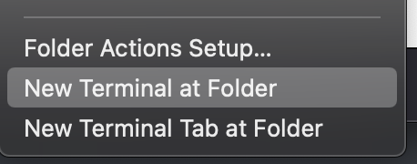
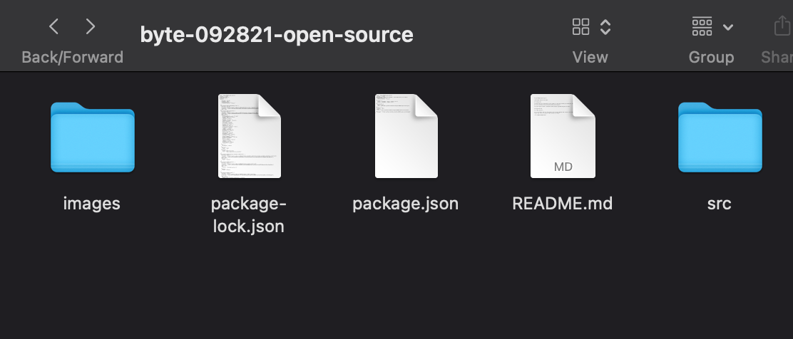

# byte-092821-open-source

Learn Open Source in an Hour

# Prerequisite

You must have git installed in your system. If you do not have git installed, please install it through [here](https://git-scm.com/book/en/v2/Getting-Started-Installing-Git)

You also should create a [GitHub account](https://github.com/join) as well.

# Getting Set Up

For **Mac Users**,

Go to the Finder and from the finder click on your desktop and create a new folder called "git." Right click on that folder and select the option "New Terminal At Folder"

From there, a terminal window should appear. In the terminal window write in the command:

git clone https://github.com/mobi-uta/byte-092821-open-source

# Creating Your Personal Note

There should be a file called byte-092821-open-source located in your git folder. In that folder the contents should look something like this.

Navigate to src > posts folder and then create a folder named "Firstname-lastname" and inside that folder create a new .md file and name it "index".
